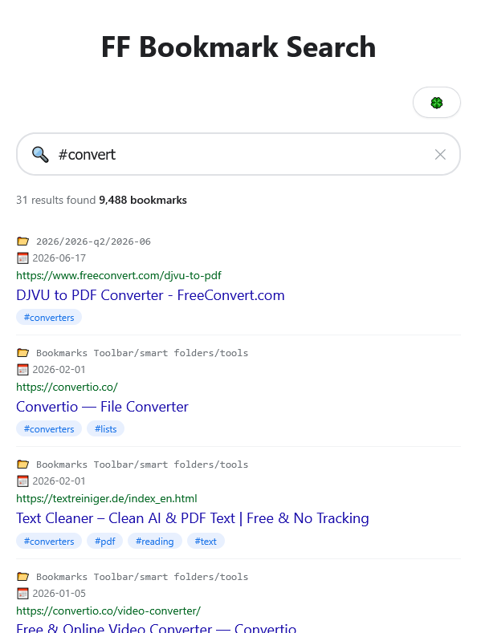

# bookmarks search

the imaginary internet of your shit or print.

## usage

add bookmarks.html from the export to the root

## search options

search operators

- name:
- folder:
- / as OR
- ""
- date:
- site:

search #tags
